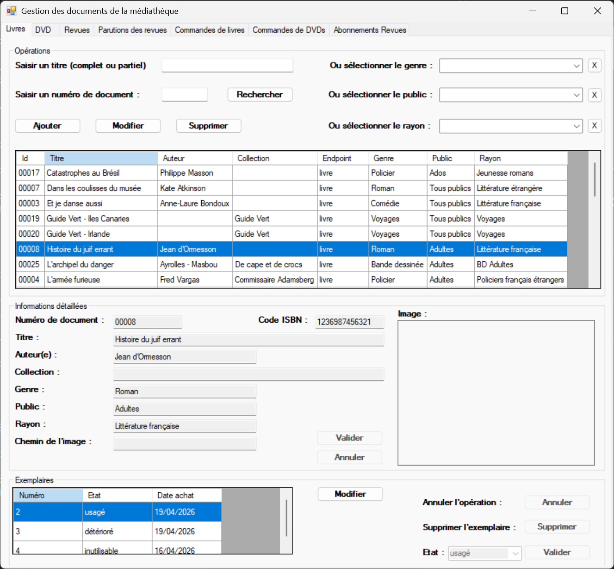

# MediaTek Documents

## Liens

* Application C# : https://github.com/patrickbrouhard/mediatekdocuments
* Installeur de l'application dans [la partie "Releases" du dépôt GitHub](https://github.com/patrickbrouhard/mediatekdocuments/releases)
    * login/pwd de l'application : root / test (autres logins disponibles : "adm", "pre" et "cul", même pwd)
* API REST : https://github.com/patrickbrouhard/rest_mediatekdocuments
* Adresse web de l'API : http://mediatekdocapi.atwebpages.com
* Page dédiée dans le portfolio hors examen : [MediaTek Documents](/portfolio/mediatek-documents).

## Contexte

Dans le cadre de cet atelier de développement, il était demandé de faire évoluer une application de bureau développée en C# permettant la gestion des documents des médiathèques de la chaîne MediaTek86.

L'application s'appuie sur une API REST développée en PHP pour accéder à une base de données MySQL centralisant les informations relatives aux livres, DVD, revues, commandes et exemplaires.

L'objectif était d'assurer la maintenance évolutive de l'application existante, d'ajouter de nouvelles fonctionnalités métier, de renforcer la sécurité, d'améliorer la qualité logicielle, de mettre en place des tests et de déployer l'ensemble de la solution.

Les évolutions apportées permettent notamment :

* la gestion complète des documents (livres, DVD et revues)
* la gestion des commandes et abonnements
* le suivi de l'état des exemplaires
* la gestion des droits d'accès selon le profil utilisateur
* le renforcement de la sécurité de l'application et de l'API
* l'intégration de journaux d'événements (logs)
* la mise en place de tests automatisés
* le déploiement de l'API et de la base de données

---

## Principales réalisations techniques

* Développement des fonctionnalités CRUD sur les livres, DVD et revues.
* Mise en œuvre des transactions SQL afin de garantir l'intégrité des données.
* Création de triggers MySQL pour automatiser certaines opérations métier.
* Développement des modules de gestion des commandes de documents et des abonnements.
* Mise en place du suivi du cycle de vie des commandes.
* Développement de la gestion des exemplaires et de leur état.
* Implémentation d'un système d'authentification et de gestion des autorisations.
* Sécurisation des accès à l'API REST.
* Intégration de la journalisation des événements avec Serilog.
* Amélioration de la qualité du code à l'aide de SonarQube.
* Réalisation de tests unitaires avec MSTest.
* Création d'une collection Postman pour tester l'API REST.
* Génération des documentations techniques de l'application et de l'API.
* Déploiement de l'API REST et de la base de données sur un hébergement distant.

---

## Architecture de la solution

L'application repose sur une architecture client-serveur composée de plusieurs couches :

* Une application de bureau développée en C# (.NET Windows Forms).
* Une API REST développée en PHP.
* Une base de données MySQL.
* Une communication HTTP entre le client lourd et l'API.

L'architecture de l'application C# suit le modèle MVC :

* Modèles : classes métier et accès aux données.
* Vues : formulaires Windows Forms.
* Contrôleurs : gestion de la logique applicative et des interactions utilisateur.

L'API REST assure l'accès sécurisé aux données et centralise les opérations de lecture et de modification de la base de données.

---

## Technologies utilisées

### Langages

* C#
* PHP
* SQL
* JavaScript

### Frameworks et bibliothèques

* .NET
* Windows Forms
* API REST
* Newtonsoft.Json

### Base de données

* MySQL

### Qualité logicielle

* SonarQube
* MSTest
* Postman

### Journalisation et supervision

* Serilog

### Outils de développement

* Visual Studio
* NetBeans
* Git
* GitHub

### Concepts mis en œuvre

* Architecture MVC
* API REST
* Programmation orientée objet
* Programmation événementielle
* Transactions SQL
* Triggers MySQL
* Authentification et gestion des droits
* Journalisation des événements
* Tests unitaires
* Documentation technique
* Développement sécurisé

Ce projet a permis de mettre en œuvre le développement d'une application répartie reposant sur une architecture client-serveur, intégrant une API REST, une base de données relationnelle, des mécanismes de sécurité, des tests automatisés et des outils de qualité logicielle.

---

## Documents annexes

* [Contexte de l'atelier](https://drive.google.com/file/d/1dNWnfG63xBVKJBhqFkwwhUaiL3YePSOC/view?usp=drive_link)
* [Contrat de développement](https://drive.google.com/file/d/1OQ_G03J5CyfHCbxHAPtJbV7WlvPAe926/view?usp=drive_link)
* [Cahier des charges](https://drive.google.com/file/d/1Zngb1obwMQXqx1-VFYbQHXVWmitDaa_2/view?usp=drive_link)
* [Les missions](https://drive.google.com/file/d/1f6isaE0jjFCDnJ9uM-BvnE0PNSPDeNBG/view?usp=drive_link)
* [PV de recette](https://drive.google.com/file/d/1ly-ABIMAmMU2WJfFW3oJchxvQTm-QUDQ/view?usp=drive_link)
* [Plan de tests](https://drive.google.com/file/d/1Z177r23k2Eybj_rToBNSymxtACyU-wgl/view?usp=drive_link)
* [Collection Postman de l'API REST](https://github.com/patrickbrouhard/rest_mediatekdocuments/blob/master/postman/Mediatek_API_Tests_CSharp_Compatible.postman_collection.json)
* [Documentation technique de l'application C#](https://github.com/patrickbrouhard/mediatekdocuments/blob/master/Documentation%20g%C3%A9n%C3%A9r%C3%A9e%20par%20Sandcastle.7z)

---

## Compétences officielles couvertes

### Bloc 1 - Support et mise à disposition de services informatiques

* Capacité à rendre compte d'un travail réalisé au sein d'une équipe projet en mettant clairement en évidence sa contribution personnelle
* Gérer le patrimoine informatique
* Répondre aux incidents et aux demandes d'assistance et d'évolution
* Développer la présence en ligne de l'organisation
* Travailler en mode projet
* Mettre à disposition des utilisateurs un service informatique

### B2.1 - Concevoir et développer une solution applicative

* Analyser un besoin exprimé et son contexte juridique
* Participer à la conception de l'architecture d'une solution applicative
* Modéliser une solution applicative
* Identifier, développer, utiliser ou adapter des composants logiciels
* Exploiter les technologies Web pour mettre en œuvre les échanges entre applications, y compris de mobilité
* Utiliser des composants d'accès aux données
* Réaliser les tests nécessaires à la validation ou à la mise en production d'éléments adaptés ou développés
* Rédiger des documentations techniques et d'utilisation d'une solution applicative
* Exploiter les fonctionnalités d'un environnement de développement et de tests

### B2.2 - Assurer la maintenance corrective ou évolutive d'une solution applicative

* Recueillir, analyser et mettre à jour les informations sur une version d'une solution applicative
* Évaluer la qualité d'une solution applicative
* Analyser et corriger un dysfonctionnement
* Mettre à jour des documentations techniques et d'utilisation d'une solution applicative
* Élaborer et réaliser les tests des éléments mis à jour

### B2.3 - Gérer les données

* Exploiter des données à l'aide d'un langage de requêtes
* Développer des fonctionnalités applicatives au sein d'un système de gestion de base de données
* Concevoir ou adapter une base de données
* Administrer et déployer une base de données
