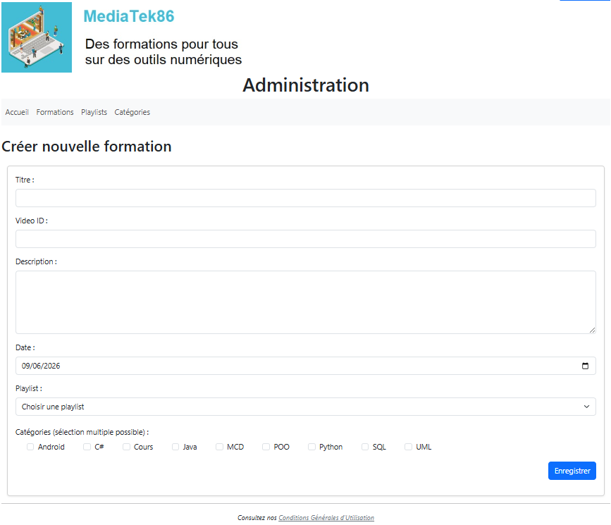

# Mediatek Formation

## Liens

- Site en ligne : https://testhebergement.go.yj.fr
- Dépôt GitHub : https://github.com/patrickbrouhard/mediatekformation

## Contexte

Dans le cadre de cet atelier de développement, il était demandé de reprendre une application Symfony existante permettant la consultation de vidéos de formation proposées par MediaTek86.

L'objectif était d'assurer la maintenance corrective et évolutive de l'application, de développer une partie back office sécurisée, de mettre en place les tests et la documentation, puis d'automatiser son déploiement.

Au départ, seule la partie front office était présente. Elle contenait uniquement les fonctionnalités globales permettant de consulter :

* la page d’accueil
* les formations
* une formation
* les playlists
* une playlist
* les CGU

Les évolutions apportées au code permettent désormais :

* d’améliorer la qualité du code existant selon les recommandations SonarLint
* d’ajouter l’affichage et le tri du nombre de formations par playlist
* de créer une partie back office sécurisée
* de gérer les formations, les playlists et les catégories
* d’ajouter une authentification administrateur
* de mettre en place des tests, une documentation et un déploiement continu

---

## Principales réalisations techniques

- Refactorisation du code existant en appliquant les recommandations SonarLint.
- Ajout du calcul et du tri du nombre de formations par playlist.
- Développement d'un back office permettant la gestion des formations, playlists et catégories.
- Mise en place des opérations CRUD sur les formations, playlists et catégories.
- Implémentation d'une authentification administrateur sécurisée.
- Mise en œuvre des protections CSRF et des validations de formulaires.
- Création de tests unitaires, d'intégration et fonctionnels avec PHPUnit.
- Génération de la documentation technique.
- Mise en place d'un pipeline de déploiement continu avec GitHub Actions.

---

## Architecture

L'application repose sur une architecture MVC (Model-View-Controller) fournie par Symfony :

- Modèles : entités Doctrine et accès aux données MySQL
- Vues : templates Twig et interface Bootstrap
- Contrôleurs : gestion des requêtes HTTP et de la logique applicative

L'application est composée :
- d'un front office destiné à la consultation des formations ;
- d'un back office sécurisé destiné à l'administration des contenus.

---

## Technologies utilisées

### Langages et développement web

* PHP 8
* HTML5
* CSS3
* JavaScript

### Frameworks et bibliothèques

* Symfony
* Twig
* Bootstrap
* Doctrine ORM

### Base de données

* MySQL

### Sécurité

* Symfony Security
* Protection CSRF
* Validation des formulaires
* Requêtes paramétrées

### Tests et qualité logicielle

* PHPUnit
* SonarLint
* Documentation PHPDoc

### Outils de développement

* Composer
* Git
* GitHub
* GitHub Actions

### Méthodes et concepts mis en œuvre

* Architecture MVC
* Développement CRUD
* Authentification et gestion des rôles
* Tests unitaires, d'intégration et fonctionnels
* Déploiement continu (CI/CD)
* Qualité de code et refactoring
* Développement sécurisé des applications web

Ce projet a permis de mettre en œuvre l'ensemble du cycle de vie d'une application Symfony : maintenance corrective et évolutive, développement d'un back office sécurisé, gestion d'une base de données relationnelle, automatisation des tests et déploiement continu.

---

## Documents annexes

* [Contexte de l'atelier](https://drive.google.com/file/d/17EXAxgbgXzcntXN19ZVyYO9mPUfad9WV/view?usp=drive_link)
* [Contrat de développement](https://drive.google.com/file/d/15ofourIMs-gKi0QlLRWrxKONFYKOmdZl/view?usp=drive_link)
* [Cahier des charges](https://drive.google.com/file/d/1k4iBoZPAjYQQ6etsTasPVnWoKZyxFd5X/view?usp=drive_link)
* [Les missions](https://drive.google.com/file/d/1CDtuNtMMNVIVOF94sjocpOTy_1qxnXld/view?usp=drive_link)
* [PV de recette](https://drive.google.com/file/d/1GAu4z801YR93ZDmM0ArCbKAQjP79TUzp/view?usp=drive_link)
* [Plan de tests](https://drive.google.com/file/d/1KsFHjX0RCZtUJH2PQZhjTQVk1a5AbcVt/view?usp=drive_link)

---

## Compétences officielles couvertes

### Bloc 1 - Support et mise à disposition de services informatiques

* Capacité à rendre compte d'un travail réalisé au sein d'une équipe projet en mettant clairement en évidence sa contribution personnelle
* Gérer le patrimoine informatique
* Répondre aux incidents et aux demandes d'assistance et d'évolution
* Développer la présence en ligne de l'organisation
* Travailler en mode projet
* Mettre à disposition des utilisateurs un service informatique

### B2.1 - Concevoir et développer une solution applicative

* Analyser un besoin exprimé et son contexte juridique
* Participer à la conception de l'architecture d'une solution applicative
* Modéliser une solution applicative
* Exploiter les ressources du cadre applicatif (framework)
* Identifier, développer, utiliser ou adapter des composants logiciels
* Exploiter les technologies Web pour mettre en œuvre les échanges entre applications, y compris de mobilité
* Utiliser des composants d'accès aux données
* Intégrer en continu les versions d'une solution applicative
* Réaliser les tests nécessaires à la validation ou à la mise en production d'éléments adaptés ou développés
* Rédiger des documentations techniques et d'utilisation d'une solution applicative
* Exploiter les fonctionnalités d'un environnement de développement et de tests

### B2.2 - Assurer la maintenance corrective ou évolutive d'une solution applicative

* Recueillir, analyser et mettre à jour les informations sur une version d'une solution applicative
* Évaluer la qualité d'une solution applicative
* Analyser et corriger un dysfonctionnement

### B2.3 - Gérer les données

* Exploiter des données à l'aide d'un langage de requêtes
* Administrer et déployer une base de données

---
