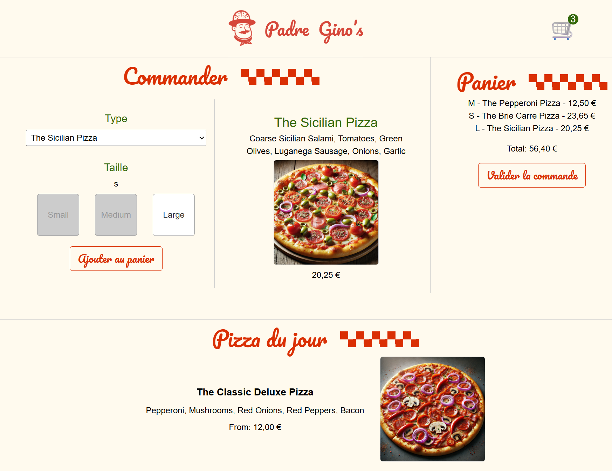
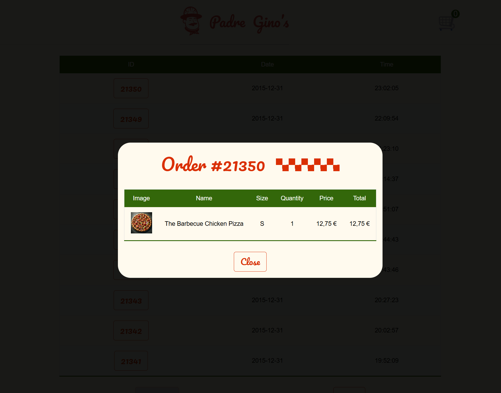
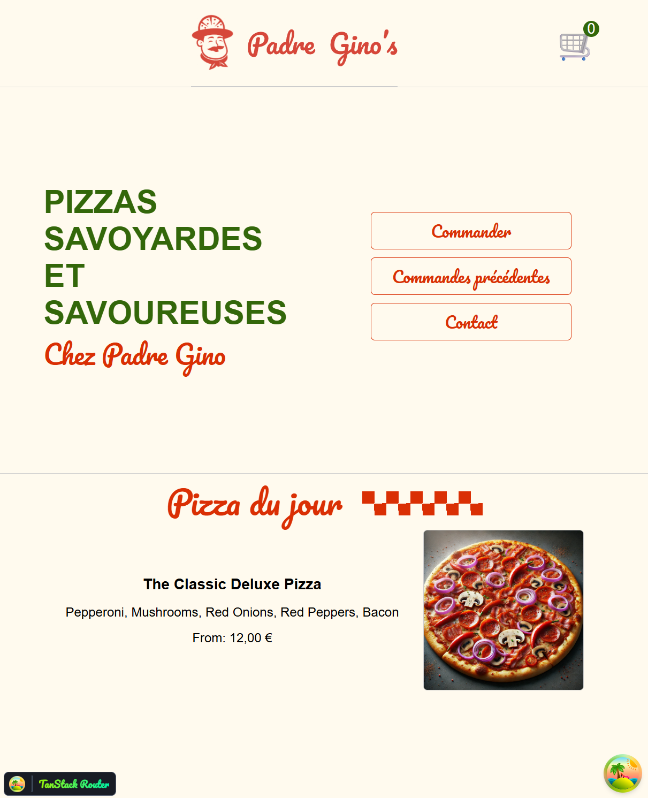

Je présente ici **Claudissimo!** (Padre Gino), une application de démonstration développée dans le cadre de la formation *Complete Intro to React v9* de Brian Holt (Netflix, Stripe, Microsoft...).
Ce projet m’a permis de mettre en pratique l’écosystème moderne de React : hooks, routing déclaratif, gestion d’état globale, intégration d’API et structuration d’une SPA propre et maintenable.
Hooks personnalisés, routing avec `@tanstack/react-router`, récupération de données avec `@tanstack/react-query` et organisation de composants orientée maintenabilité.



<br>

<svg xmlns="http://www.w3.org/2000/svg" 
     class="w-5 h-5 mr-2 inline-block" 
     fill="currentColor" viewBox="0 0 16 16">
<path d="M8 0C3.58 0 0 3.58 0 8a8 
           8 0 0 0 5.47 7.59c.4.07.55-.17.55-.38 
           0-.19-.01-.82-.01-1.49-2 
           .37-2.53-.49-2.69-.94-.09-.23-.48-.94-.82-1.13
           -.28-.15-.68-.52-.01-.53.63-.01 1.08.58 
           1.23.82.72 1.21 1.87.87 
           2.33.66.07-.52.28-.87.51-1.07-1.78-.2-3.64-.89-3.64-3.95
           0-.87.31-1.59.82-2.15-.08-.2-.36-1.02.08-2.12
           0 0 .67-.21 2.2.82a7.65 7.65 0 0 1 2-.27c.68 
           0 1.36.09 2 .27 1.53-1.04 2.2-.82 
           2.2-.82.44 1.1.16 1.92.08 2.12.51.56.82 
           1.27.82 2.15 0 3.07-1.87 3.75-3.65 
           3.95.29.25.54.73.54 1.48 
           0 1.07-.01 1.93-.01 2.2 
           0 .21.15.46.55.38A8 8 0 0 0 16 
           8c0-4.42-3.58-8-8-8z"/>
</svg>
Voir sur GitHub


## Objectifs et valeur ajoutée

- **Objectifs pédagogiques** : Découvrir l'usage des hooks (built-in et custom), apprendre le routage moderne avec `@tanstack/react-router` et pratiquer la récupération/gestion de données asynchrones.
- **Valeur ajoutée** : L’application valide ma compréhension des patterns essentiels de React moderne et démontre ma capacité à structurer une interface dynamique cohérente, testable et évolutive.

## Fonctionnalités principales

- Catalogue de pizzas et page de commande interactive.
- Panier global persistant (`CartContext`) via la Context API, recalcul automatique du total.
- Hook `usePizzaOfTheDay` pour la récupération asynchrone depuis une API.
- Historique de commandes et formulaire de contact mocké.
- Gestion robuste des erreurs grâce à un ErrorBoundary.
- Build rapide et bundle final optimisé grâce à Vite.



## Technologies utilisées

- **Langages / outils** : JavaScript (ESModules), React, Vite.
- **Librairies** : `@tanstack/react-router`, `@tanstack/react-query`.
- **Architecture** : composants fonctionnels, hooks personnalisés, Context API.
- **Tests / qualité** : configuration ESLint / Prettier présente dans le projet.
- **Build / Dev** : Vite (configuration dans `vite.config.js`).

## Compétences démontrées

**Techniques**

- Conception et intégration de hooks React (state (`useState`), side-effects (`useEffect`), debug (`useDebugValue`)).
- Mise en place d’un state global léger et prévisible avec Context (`createContext`).
- Intégration d’APIs, gestion des effets asynchrones et mise en forme UI.
- Configuration d’un routage modulaire et performant.

**Transversales**
- Structuration claire du code et séparation cohérente des responsabilités.
- Mise en place d’une petite architecture évolutive adaptée à une SPA.
- Attention systématique à l’expérience utilisateur (temps de chargement, erreurs, feedback).

---

## Extraits de code représentatifs

### Hook personnalisé — récupération asynchrone
*Fichier :*`src/usePizzaOfTheDay.jsx`  
```js
import { useState, useEffect, useDebugValue } from "react";

export const usePizzaOfTheDay = () => {
  const [pizzaOfTheDay, setPizzaOfTheDay] = useState(null);
  useDebugValue(pizzaOfTheDay ? `${pizzaOfTheDay.name}` : "Loading...");

  useEffect(() => {
    async function fetchPizzaOfTheDay() {
      const response = await fetch("/api/pizza-of-the-day");
      const data = await response.json();
      setPizzaOfTheDay(data);
    }
    fetchPizzaOfTheDay();
  }, []);

  return pizzaOfTheDay;
};
```

*Illustre l’usage d’un hook personnalisé, la séparation des effets et l’intégration d’un retour de debug utile pour l’inspection en devtools.*

### Calcul du total du panier et rendu
*Fichier :* `src/Cart.jsx`

```js
export default function Cart({ cart, checkout }) {
  let total = 0;
  for (let i = 0; i < cart.length; i++) {
    const current = cart[i];
    total += current.pizza.sizes[current.size];
  }
  // ...
  return (
    <div className="cart">
      {/* ...liste des items... */}
      <p>Total: {intl.format(total)}</p>
      <button onClick={checkout}>Valider la commande</button>
    </div>
  );
}
```

*Montre la logique métier simple et lisible (agrégation des prix) et l’affichage formaté côté UI.*
### Gestion d’erreurs globale (Error Boundary)
*Fichier :* `src/ErrorBoundary.jsx`

```js
class ErrorBoundary extends Component {
  state = { hasError: false };
  static getDerivedStateFromError() { return { hasError: true }; }
  componentDidCatch(error, info) { console.error("ErrorBoundary caught", error, info); }
  render() {
    if (this.state.hasError) {
      return <div className="error-boundary">...fallback UI...</div>;
    }
    return this.props.children;
  }
}
export default ErrorBoundary;
```

Cet *ErrorBoundary* enveloppe l’ensemble de l’application, intercepte les erreurs runtime et empêche un crash global. Il garantit une interface stable en isolant les défaillances d’un composant sans impacter le reste du rendu.

*Note : dans ce contexte pédagogique, l’implémentation en “class component” était volontaire afin d’illustrer le mécanisme interne des Error Boundaries. Dans un projet moderne, j’utiliserais plutôt une solution comme `react-error-boundary`, qui encapsule cette logique tout en offrant une API fonctionnelle.*

### Utilisation de Context pour pouvoir maintenir le panier sur toutes les pages

La gestion du panier est volontairement centralisée dans un contexte global afin d’éviter la propagation de props et de garantir une synchronisation immédiate entre toutes les vues.

#### 1. **Création du contexte**
```jsx
// contexts.jsx
import { createContext } from "react";

export const CartContext = createContext([[], function () {}]);
```

- On définit un contexte `CartContext` qui contient par défaut un state vide (le panier) et une setter vide.
- Cela permettra de partager le **state du panier** dans toute l’application.

#### 2. **Provider à la racine**
```jsx
// __root.jsx__
const cartHook = useState([]);

<CartContext.Provider value={cartHook}>
  <Header />
  <Outlet />
  <PizzaOfTheDay />
</CartContext.Provider>
```
- on crée le **state global du panier** avec `useState([])` (pas de destructuration, on passe tout).
- On passe ce hook `[cart, setCart]` au `Provider`.
- Résultat : tous les composants enfants (`Header`, `Order`, etc.) peuvent accéder au panier via `useContext`.

#### 3. **Consommation du contexte**
##### Dans `Order.jsx`
```jsx
const [cart, setCart] = useContext(CartContext);
```
- On récupère directement le panier et le setter.
- On ajoute des pizzas au panier avec `setCart([...cart, newPizza])`.
- On peut aussi vider le panier après un `checkout`.

##### Dans `Header.jsx`
```jsx
const [cart] = useContext(CartContext);
<span className="nav-cart-number">{cart.length}</span>
```
- On affiche le nombre d’articles dans le panier.
- Pas besoin de passer des props depuis la racine → le contexte simplifie énormément.



---

## Conclusion personnelle

Ce premier projet React m’a permis d’acquérir une vraie intuition de l’état dynamique et du modèle mental du framework, bien loin des interfaces statiques auxquelles j’étais habitué.

Les hooks m’ont révélé une manière plus modulaire, dynamique et logique de structurer une interface. Cette expérience constitue désormais un socle solide pour aborder des architectures frontend plus ambitieuses et mieux comprendre la logique des frameworks modernes.

---
