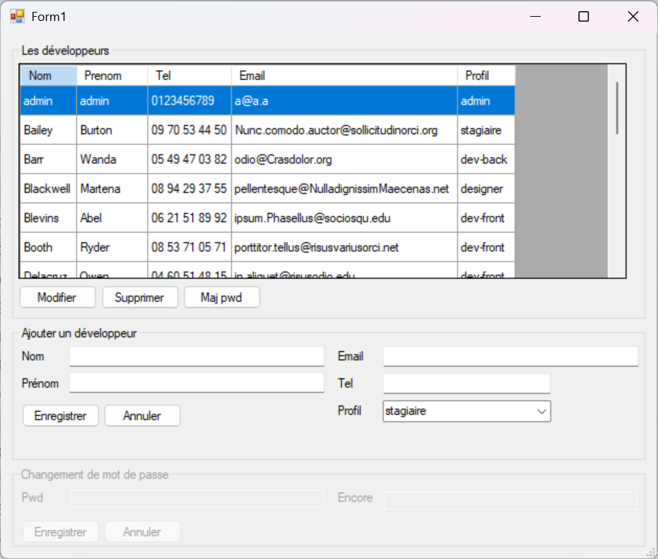
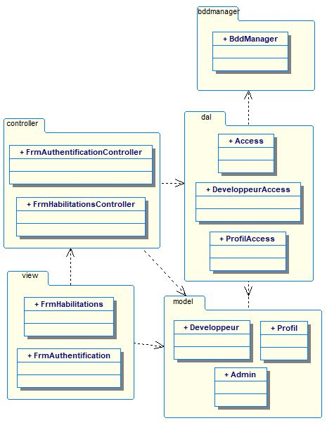
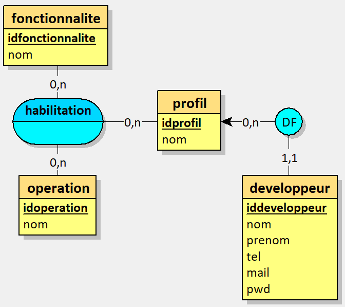

# Habilitations — utilitaire de gestion des habilitations

Je présente ici **Habilitations**, une application interne développée en C# (Visual Studio 2022) dans le cadre de ma formation, destinée à faciliter la gestion des comptes et des profils développeurs d’une entreprise.
J'ai conçu cette application pour offrir un outil simple, robuste et réutilisable permettant d’authentifier des administrateurs, gérer des développeurs, modifier des mots de passe et administrer les profils via une base MySQL.




<svg xmlns="http://www.w3.org/2000/svg" 
     class="w-5 h-5 mr-2 inline-block" 
     fill="currentColor" viewBox="0 0 16 16">
<path d="M8 0C3.58 0 0 3.58 0 8a8 
           8 0 0 0 5.47 7.59c.4.07.55-.17.55-.38 
           0-.19-.01-.82-.01-1.49-2 
           .37-2.53-.49-2.69-.94-.09-.23-.48-.94-.82-1.13
           -.28-.15-.68-.52-.01-.53.63-.01 1.08.58 
           1.23.82.72 1.21 1.87.87 
           2.33.66.07-.52.28-.87.51-1.07-1.78-.2-3.64-.89-3.64-3.95
           0-.87.31-1.59.82-2.15-.08-.2-.36-1.02.08-2.12
           0 0 .67-.21 2.2.82a7.65 7.65 0 0 1 2-.27c.68 
           0 1.36.09 2 .27 1.53-1.04 2.2-.82 
           2.2-.82.44 1.1.16 1.92.08 2.12.51.56.82 
           1.27.82 2.15 0 3.07-1.87 3.75-3.65 
           3.95.29.25.54.73.54 1.48 
           0 1.07-.01 1.93-.01 2.2 
           0 .21.15.46.55.38A8 8 0 0 0 16 
           8c0-4.42-3.58-8-8-8z"/>
</svg>
Voir sur GitHub


## Objectifs & valeur ajoutée

- Fournir un utilitaire léger pour gérer les habilitations sans impacter l’application principale de l’entreprise.
- Isoler l’accès à la base via une couche réutilisable (`bddmanager`) pour simplifier le remplacement du SGBD ou la réutilisation du code.
- Offrir des opérations courantes (CRUD sur développeurs, profils, modification de pwd) avec contrôle d’accès admin.

## Fonctionnalités principales

- Authentification des administrateurs (vérification du profil `admin`).
- Liste, création, modification et suppression des développeurs.
- Gestion des profils (rôles).
- Changement sécurisé du mot de passe (hachage SHA2 côté base dans l’implémentation actuelle).
- Architecture MVC avec couche DAL (`dal`) et gestion centralisée de la connexion (`bddmanager`).

## Technologies utilisées

- Langage : C# (.NET / Visual Studio 2022)
- Base de données : MySQL (phpMyAdmin)
- Architecture : pattern MVC (WinForms + controllers)
- Structure : paquetages `bddmanager`, `dal`, `controller`, `model`
- Serilog pour gérer les logs
- SonarQube pour **analyser la qualité du code et détecter les vulnérabilités**.

## Illustrations





## Compétences démontrées

**Techniques** : conception MVC, accès aux données (DAL), gestion de la connexion MySQL (singleton), requêtes paramétrées, hachage de mots de passe, gestion d’erreurs.
**Transversales** : séparation des responsabilités, documentation du code, gestion de projet (phases/commits), capacité à produire un utilitaire réutilisable pour une équipe métier.

## Extraits de code représentatifs

### 1) Singleton d’accès à la BDD (connexion et ouverture)

Fichier : `habilitations2024/bddmanager/BddManager.cs`

```csharp
// singleton + constructeur
private static BddManager instance = null;
private readonly MySqlConnection connection;

private BddManager(string stringConnect)
{
    connection = new MySqlConnection(stringConnect);
    connection.Open();
}

public static BddManager GetInstance(string stringConnect)
{
    if (instance == null)
    {
        instance = new BddManager(stringConnect);
    }
    return instance;
}
```

_Cette classe illustre le design pattern Singleton appliqué à la gestion d'une connexion MySQL. Le constructeur privé empêche l'instanciation directe, et la méthode statique GetInstance garantit qu'une seule instance de BddManager existe dans l'application. Cela permet de centraliser et réutiliser la même connexion à la base de données._

### 2) Mise à jour du mot de passe (hachage côté base)

Fichier : `habilitations2024/dal/DeveloppeurAccess.cs` — méthode `UpdatePwd`

```csharp
public void UpdatePwd(Developpeur developpeur)
{
    if (access?.Manager == null) return;

    var req = @"
                UPDATE developpeur
                SET pwd=SHA2(@pwd, 256)
                WHERE iddeveloppeur=@id";
    var parametres = new Dictionary<string, object>
    {
        {"@id", developpeur.Iddeveloppeur},
        {"@pwd", developpeur.Pwd}
    };
    try
    {
        access.Manager.ReqUpdate(req, parametres);
    }
    catch (Exception e)
    {
        Console.Error.WriteLine($"Erreur dans UpdatePwd() : {e.Message}");
        Environment.Exit(0);
    }
}
```

_Extrait montrant l’usage de requêtes paramétrées et le choix de SHA2 pour le hachage._

_SHA‑2 est choisi car il est robuste et standardisé, contrairement à MD5 ou SHA‑1, mais de nos jours c'est tout de même vulnérable aux attaques brute force ou dictionnaires. Donc pour les mots de passe, en situation réelle, il vaut mieux utiliser un algorithme spécialisé comme bcrypt ou Argon2, qui ralentit volontairement le calcul et rend les attaques beaucoup plus coûteuses._

### 3) Contrôle d’authentification (vérification profil admin)

Fichier : `habilitations2024/dal/DeveloppeurAccess.cs` — méthode `ControleAuthentification`

```csharp
public Boolean ControleAuthentification(Admin admin)
{
    var req = @"
        SELECT * FROM developpeur d JOIN profil p USING(idprofil)
        WHERE d.nom = @nom
          AND d.prenom = @prenom
          AND d.pwd = SHA2(@pwd, 256)
          AND p.nom = 'admin';";
    var parametres = new Dictionary<string, object>
    {
        {"@nom", admin.Nom},
        {"@prenom", admin.Prenom},
        {"@pwd", admin.Pwd},
    };
    var resultat = access.Manager.ReqSelect(req, parametres);
    return resultat?.Count > 0;
}
```

_Requête paramétrée qui confirme la présence d’un profil `admin` — logique simple et lisible._

## Conclusion personnelle

J’ai réalisé ce projet dans le cadre d'une mise en situation où l'on répond à un besoin concret de l’entreprise : disposer d’un outil d’administration simple et indépendant.
En le développant j’ai renforcé ma pratique du pattern MVC, affiné ma gestion des accès à la base (singleton réutilisable) et clarifié l'utilisation d'un intermédiaire entre logique métier et BDD (c'est la DAL, Data Access Layer). Ce projet m’a aussi confronté à des choix de sécurité (hachage côté BDD vs gestion côté application), ce qui m’a poussé à réfléchir à l’amélioration future de la gestion des mots de passe.
