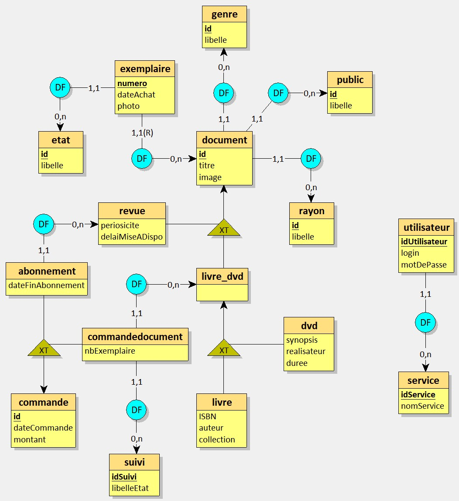
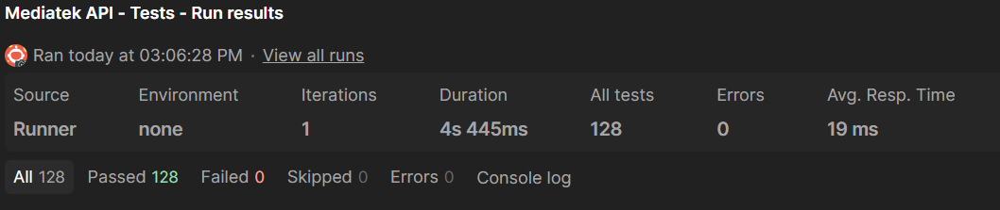
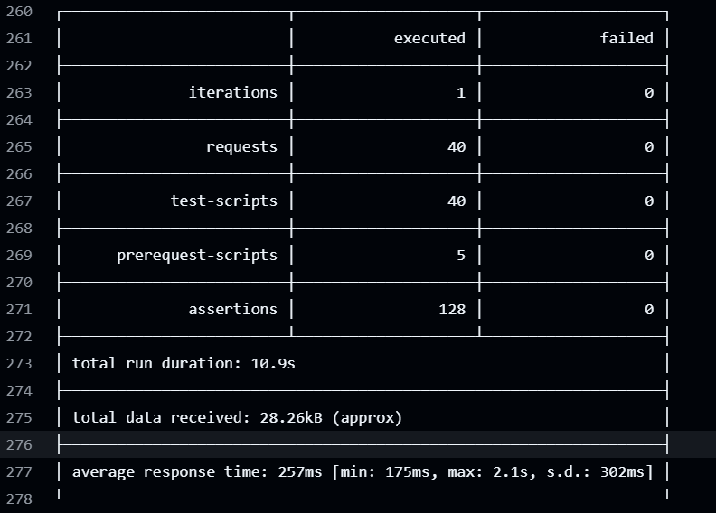

## Présentation

Ce projet a été réalisé dans le cadre de ma formation en BTS SIO SLAM. Ainsi, la base des deux dépôts m’a été fournie, et j’ai ensuite complété et adapté l’ensemble pour répondre à un plan de missions (gestion de documents, commandes/abonnements, suivi d’exemplaires, authentification, logs, déploiement).

Le projet est réparti sur deux dépôts qui forment **un seul projet cohérent** :

- **API REST PHP** : `patrickbrouhard/rest_mediatekdocuments`
- **Client lourd C# (WinForms)** : `patrickbrouhard/mediatekdocuments`

Mon fil conducteur a été d’ajouter de nouvelles fonctionnalités à l’application de bureau, tout en renforçant la logique métier côté serveur (transactions SQL, contraintes de suppression, authentification, etc.).

En pratique : l’app de bureau appelle l’API, l’API exécute SQL (souvent avec transactions), puis renvoie un JSON que le client désérialise.

.")

---

## Ce que fait le projet (vue d'ensemble)

### Gestion des documents
- Consultation et gestion de **livres / DVD / revues**
- Création / modification / suppression avec contraintes côté serveur (ex: suppression refusée si des dépendances existent)

### Gestion des exemplaires
- Consultation des exemplaires d’un document
- Mise à jour de l’état et suppression d’exemplaires via l’API

### Commandes et abonnements
- Gestion des commandes de documents et des abonnements de revues
- Alerte côté API pour les abonnements arrivant à échéance (requête dédiée)

### Authentification
- Endpoint d’authentification applicative : l’API vérifie le mot de passe via `password_verify()`, le client récupère un utilisateur sans le champ `pwd`

---

## Technologies utilisées

### Client C# (WinForms)
- C# / **.NET Framework**
- **Newtonsoft.Json** (sérialisation/désérialisation, `JObject`)
- **Serilog** (logs configurés dans `MediaTekDocuments/dal/Access.cs`)
- **GitHub Actions** : build + packaging de l’installer (`.github/workflows/build-installer.yml`)
- **Inno Setup** : génération d’installeur (appel `iscc` dans la CI)

### API PHP
- PHP + SQL (requêtes et logique métier dans `src/MyAccessBDD.php`)
- Authentification applicative via **`password_verify()`**
- **GitHub Actions** : déploiement FTP (`.github/workflows/main.yml`, avec secrets GitHub)

---

## Points techniques

### Travail en mode projet
- Utilisation de **Git** dans le terminal avec les commandes standards (`git checkout -b`, `git add`, `git commit`, `git push`, etc).
- Utilisation de **Github Projects** pour organiser les tâches (*kanban*).
- Découpage du besoin en tâches traçables (**Issues**), alignées sur les missions définies dans le plan de projet.
- Utilisation de **branches dédiées** pour les fonctionnalités majeures, développement par incréments via **Pull Requests**, avec des PR thématiques (1 PR = 1 lot fonctionnel / refactor / sécurité / qualité).
- Validation par merge : chaque fonctionnalité est “terminée” quand elle est intégrée (**PR mergée**) et l’issue associée est clôturée.

### Architecture & patterns

- Développement desktop WinForms multi-onglets.
- Gestion événementielle WinForms + data-binding (BindingSource/DataGridView/ComboBox).
- Séparation des responsabilités entre UI WinForms, accès API et modèles métier (type MVC).
- Pattern de conception : SIngleton + factory + command DTO (transport de données) côté client.

### Accès aux données

- API REST utilisée pour les opérations CRUD sur les documents, exemplaires, commandes et abonnements.
- Logique métier côté serveur (transactions, contraintes de suppression, whitelisting des champs modifiables, etc).
- Authentification API + gestion des droits applicatifs : login obligatoire, règles d'accès par service, blocage à la connexion si accès interdit, et les fonctionnalités accessibles dépendent des droits.
- Gestion d'erreurs (try/catch, codes de retour, logs, etc).

### Conception et gestion de la base de données SQL

- Exploitation et évolution d'un schéma relationnel MySQL existant (Merise 2).
- Gestion des relations entre documents, exemplaires, commandes et abonnements.
- Règles garantissant la cohérence des données (contraintes, suppressions contrôlées, triggers).
- Création automatique des exemplaires lors du passage d'une commande à l'état « livrée » via un trigger SQL.



### Qualité et outils

- **Serilog** pour les logs côté client (configuration dans `MediaTekDocuments/dal/Access.cs`).
- **GitHub Actions** pour automatiser le build et le déploiement (API + client).
- **Inno Setup** pour générer un installeur Windows à partir de la CI
- Documentation technique (README, commentaires de code, etc).
- Messages utilisateur clairs et feedbacks d’erreur dans l’interface (MessageBox).
- **SonarQube** : analyse de la qualité du code (code smells, bugs potentiels, etc).
- Tests unitaires MSTest pour la logique métier côté client (ex: `MediaTekDocumentsTests/AccessTests.cs`).
- Utilisation de **Postman** pour construire une collection de tests API.
- Exécution automatisée de cette collection avec **Newman** dans un workflow GitHub Actions déclenché après le déploiement FTP de l’API.

### UX & fonctionnalités

- CRUD documents (Livres/DVD/Revues), onglets, recherche, filtres, tri.
- Gestion des exemplaires (état, suppression).
- Commandes et abonnements avec suivi des échéances (ex: alerte de fin d'abonnement à l'ouverture).

### Packaging / automatisation / déploiement

- Build de l’application client via GitHub Actions (sur tags `v*`), génération d’un installeur avec Inno Setup, et publication dans une GitHub Release.
- Déploiement de l’API via FTP dans la CI, avec exclusion du fichier `.env` contenant les secrets de connexion à la base de données.
- Utilisation de secrets GitHub pour stocker les identifiants de connexion à la base de données et au serveur FTP.
- Configuration "release", afin de pouvoir garder une configuration de développement locale sans avoir à modifier le code.

 avec login prérempli et connexion à la base de données locale, à droite la version de production (release) avec login vide et connexion à la base de données distante).")

### Tests API automatisés après déploiement

J’ai mis en place une collection de tests Postman pour vérifier les échanges possibles entre le client WinForms et l’API.

La collection est structurée pour rester autant que possible idempotente : les scénarios créent des données de test, les modifient, puis les suppriment afin de limiter les effets persistants sur la base de données.

Ces tests sont exécutés automatiquement avec **Newman**, l’outil en ligne de commande de Postman, dans un workflow GitHub Actions déclenché après le workflow de déploiement FTP :

```txt
Push sur master
↓
Déploiement FTP de l’API
↓
Exécution des tests API avec Newman
```

Cette automatisation permet de vérifier que l’API en ligne répond correctement après chaque déploiement.






---

## Extraits de code

### 1) Transaction multi-tables (API)

**Fichier :** `src/MyAccessBDD.php`  
**Exemple :** `insertLivre(...)` (même logique générale pour DVD / revue)

```php
$this->conn->transaction(function () use ($champs) {

    $id = $this->getNextId(self::LIVRE);

    if (!$this->insertDocument($id, $champs)) {
        throw new Exception("Erreur insertion document");
    }

    if (!$this->insertOneTupleOneTable("livres_dvd", ["id" => $id])) {
        throw new Exception("Erreur insertion livres_dvd");
    }

    if (!$this->insertOneTupleOneTable("livre", [
        "id" => $id,
        "ISBN" => $champs["ISBN"] ?? null,
        "auteur" => $champs["auteur"] ?? null,
        "collection" => $champs["collection"] ?? null
    ])) {
        throw new Exception("Erreur insertion livre");
    }
});
```

Intégrité des données + approche transactionnelle “tout ou rien” (atomicité).

---

### 2) DAL C# : sérialisation + exécution d’une commande (client)

**Fichier :** `MediaTekDocuments/dal/Access.cs`  
**Exemple :** `AjouterDocument(...)` + `ExecuteCommande(...)`

```csharp
public bool AjouterDocument(Document document)
{
    string endpoint = document.Endpoint;
    string json = JsonConvert.SerializeObject(document, new CustomDateTimeConverter());

    return ExecuteCommande(POST, endpoint, CHAMPS + json);
}

private bool ExecuteCommande(string methode, string endpoint, string parametres)
{
    JObject retour = api.RecupDistant(methode, endpoint, parametres);

    string code = (string)retour["code"];
    int result = 0;

    if (retour["result"] != null)
    {
        int.TryParse(retour["result"].ToString(), out result);
    }

    return code == "200" && result > 0;
}
```

Centralisation des échanges + contrat JSON simple.

---

### 3) Authentification (API)

**Fichier :** `src/MyAccessBDD.php`  
**Méthode :** `authentifierUtilisateur(...)`

```php
if (!password_verify($motDePasse, $utilisateur["pwd"])) {
    return null;
}

unset($utilisateur["pwd"]);
return $utilisateur;
```

Vérification de mot de passe côté serveur et attention à ne pas renvoyer le hash au client.

---

## Conclusion

Ce projet, exécuté en tant qu'atelier professionnel lors de ma formation, m’a permis de progresser et de me mettre en situation en tant que profil junior : **partir d’une base existante**, comprendre les conventions déjà en place, puis ajouter les fonctionnalités demandées, et tout cela en "mode projet".

Ce projet m'a également permis d'élargir ma vision du développement logiciel en m'intéressant non seulement à la programmation de l'application et de l'API, mais aussi à leur packaging, leur déploiement et leur automatisation avec GitHub Actions. Cette expérience (et celle du projet MediaTekFormation) a renforcé mon intérêt pour les problématiques d'infrastructure et de DevOps.

---
