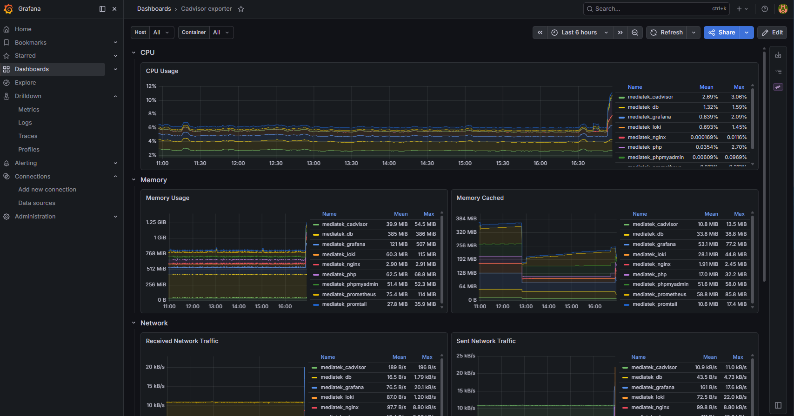
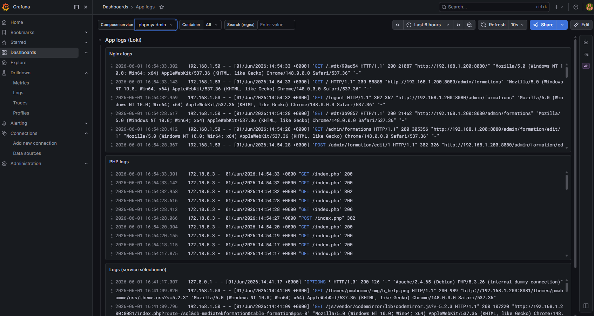

## Présentation

J’ai réalisé ce projet afin de disposer d’un **environnement local reproductible** permettant d’exécuter une application Symfony développée dans le cadre de ma formation BTS SIO SLAM, [MediatekFormation](https://github.com/patrickbrouhard/mediatekformation), mais sans intégrer directement son code dans ce dépôt, afin que l’application puisse évoluer indépendamment dans son propre repository.

- ce repo contient **le stack Docker** (app + base de données),
- un script qui **clone l’application Symfony** depuis un autre dépôt dans `app/mediatekformation`,
- et un deuxième stack Docker Compose optionnel qui ajoute une **observabilité de base** (métriques + logs) via **Prometheus / Loki / Grafana**.

Ce projet me sert de support pour pratiquer des sujets DevOps concrets : orchestration locale, automatisation, init base de données, et premiers réflexes de CI et de sécurité côté repo.


<svg xmlns="http://www.w3.org/2000/svg" 
     class="w-5 h-5 mr-2 inline-block" 
     fill="currentColor" viewBox="0 0 16 16">
<path d="M8 0C3.58 0 0 3.58 0 8a8 
           8 0 0 0 5.47 7.59c.4.07.55-.17.55-.38 
           0-.19-.01-.82-.01-1.49-2 
           .37-2.53-.49-2.69-.94-.09-.23-.48-.94-.82-1.13
           -.28-.15-.68-.52-.01-.53.63-.01 1.08.58 
           1.23.82.72 1.21 1.87.87 
           2.33.66.07-.52.28-.87.51-1.07-1.78-.2-3.64-.89-3.64-3.95
           0-.87.31-1.59.82-2.15-.08-.2-.36-1.02.08-2.12
           0 0 .67-.21 2.2.82a7.65 7.65 0 0 1 2-.27c.68 
           0 1.36.09 2 .27 1.53-1.04 2.2-.82 
           2.2-.82.44 1.1.16 1.92.08 2.12.51.56.82 
           1.27.82 2.15 0 3.07-1.87 3.75-3.65 
           3.95.29.25.54.73.54 1.48 
           0 1.07-.01 1.93-.01 2.2 
           0 .21.15.46.55.38A8 8 0 0 0 16 
           8c0-4.42-3.58-8-8-8z"/>
</svg>
Voir sur GitHub


---

## Objectifs et valeur ajoutée

### Objectifs
- Lancer un stack Symfony rapidement avec :
  - Nginx (HTTP),
  - PHP-FPM (exécution du code PHP),
  - MySQL (données persistées),
  - phpMyAdmin (outil d'intervention sur la base de données).
- Automatiser l’import de l’application et l’initialisation de la base.
- Ajouter un socle d’observabilité local :
  - métriques conteneurs (cAdvisor + Prometheus),
  - logs centralisés (Promtail + Loki),
  - visualisation (Grafana) **provisionnée automatiquement**.
- S'intégrer dans le workflow du [homelab](../IaC-Proxmox) afin de pouvoir faire, en "un clic", la création de la VM, le déploiement de la stack, et l'accès à l'application + monitoring. Ce qui ouvre d'ailleurs la possibilité d'avoir un environnement de test jetable.

### Valeur ajoutée
-  Un dépôt dédié à l’infrastructure et au déploiement local de l’application.
- Un workflow d’installation/réinitialisation simplifié via `Makefile`.
- Un stack monitoring utilisable dès le premier démarrage (datasources + dashboards montés en provisioning).



---

## Fonctionnalités principales

### 1) Stack application (Docker Compose)
Définie dans `docker-compose.yml` :

- `nginx` (port hôte `8080`) sert le répertoire `public/` Symfony et proxy les fichiers PHP vers PHP-FPM.
- `php` est construit à partir de `docker/php/Dockerfile`
- `db` (MySQL 8.0) :
  - persiste ses données via un volume (`db_data`),
  - exécute les scripts SQL au premier démarrage via le montage `./docker/mysql/init:/docker-entrypoint-initdb.d`,
  - expose un `healthcheck` MySQL.
- `phpmyadmin` (port hôte `8081`) dépend du `db` en condition `service_healthy`.

Accès :

- App : http://localhost:8080
- phpMyAdmin : http://localhost:8081
- MySQL : `localhost:3306`

### 2) Import automatique de l’app + seed SQL
Le dépôt ne contient pas l’app Symfony : elle est clonée via `scripts/import-app.sh`.

Le script :
- clone `https://github.com/patrickbrouhard/mediatekformation.git` dans `app/mediatekformation` si le dossier n’existe pas,
- copie `app/mediatekformation/sql/seed.sql` vers `docker/mysql/init/` (pour initialiser la base au démarrage MySQL).

### 3) Stack observabilité séparée (Docker Compose)
Démarrée via `docker-compose.monitoring.yml` :

- Prometheus (port `9090`) avec une config simple (`docker/monitoring/prometheus/prometheus.yml`) qui scrappe Prometheus + cAdvisor.
- cAdvisor (port `8082`) pour les métriques conteneurs.
- Loki (port `3100`) pour le stockage et le requêtage des logs.
- Promtail : se connecte à la socket Docker pour détecter automatiquement les conteneurs, lit leurs logs, et ajoute des labels (`compose_service`, `container`, `image`, etc.) via `docker/monitoring/promtail/promtail-config.yml`.
- Grafana (port `3000`) avec identifiants dev `admin/admin` et **provisioning automatique** :
  - datasources : `docker/monitoring/grafana/provisioning/datasources/datasources.yml` (Prometheus + Loki),
  - dashboards provider : `docker/monitoring/grafana/provisioning/dashboards/dashboards.yml`,
  - dashboards JSON montés depuis `docker/monitoring/grafana/dashboards/`.

### 4) CI GitHub Actions (qualité + sécurité)
Présents dans `.github/workflows/` :

- `docker.yml` :
  - build de l’image PHP (`docker build ./docker/php`),
  - validation de la configuration compose (`docker compose config --quiet`).
- `security.yml` :
  - exécute `composer audit` (schedule hebdo + push sur `composer.lock`),
  - installe PHP 8.3 via `shivammathur/setup-php`.
- `secrets-scan.yml` :
  - scan via `gitleaks/gitleaks-action`,
  - `fetch-depth: 0` (scan sur historique complet),
  - utilise `secrets.GITHUB_TOKEN`.

---

## Technologies utilisées

- **Docker / Docker Compose v2**
- **Nginx**
- **PHP 8.3 (PHP-FPM)** + **Composer**
- **MySQL 8.0**
- **phpMyAdmin**
- **Prometheus**
- **Grafana** (provisioning datasources/dashboards)
- **Loki**
- **Promtail**
- **cAdvisor**
- **GitHub Actions**
- **Gitleaks**
- **Bash**
- **Make**

---

## Compétences DevOps mises en pratique

### Orchestration & reproductibilité
- Définition claire des services et des volumes dans `docker-compose.yml`.
- Healthcheck DB + dépendance `service_healthy` pour phpMyAdmin (on attend que la DB soit prête).

### Automatisation / “bootstrap”
- `Makefile` : commandes courantes + enchaînements (`init`, `fresh`) pour installer ou repartir de zéro.
- `scripts/import-app.sh` : clonage conditionnel + copie contrôlée du `seed.sql`.

### Observabilité
- Prometheus collecte les métriques exposées par cAdvisor `docker/monitoring/prometheus/prometheus.yml`.
- Promtail découvre les conteneurs via le socket Docker et ajoute des labels utiles (`compose_service`, `container`, etc.) dans `docker/monitoring/promtail/promtail-config.yml`.
- Grafana est provisionné par fichiers (datasources + dashboards) via `docker/monitoring/grafana/provisioning/...`.

### Sécurité simple
- Secret scanning automatique via Gitleaks (`.github/workflows/secrets-scan.yml`).
- Audit de dépendances PHP via `composer audit` (`.github/workflows/security.yml`).
- Gestion de variables sensibles via `.env` (exemple `.env.example`).

> Limite : Grafana utilise `admin/admin` et Loki est configuré avec `auth_enabled: false` — c’est acceptable pour une stack locale de dev, mais ce n’est bien sûr pas un setup “prod”.

---

## Extraits de code représentatifs

### 1) Automatisation du workflow d’installation (Makefile)
Chemin : `Makefile`

```makefile
init: # Installation complète sans reset DB
	make import-app
	make build
	make upmonitoring
	make composer
	make migrate

fresh: # Installation complète avec reset DB
	make reset-db
	make init
```

Deux workflows sont prévus :
- `init` pour une installation classique,
- `fresh` pour repartir d’un environnement propre.

---

### 2) Script Bash d’import applicatif + seed SQL
Chemin : `scripts/import-app.sh`

```bash
set -e # Arrête le script en cas d'erreur

APP_DIR="$PROJECT_ROOT/app/mediatekformation"
MYSQL_INIT_DIR="$PROJECT_ROOT/docker/mysql/init"
REPO_URL="https://github.com/patrickbrouhard/mediatekformation.git"

if [ ! -d "$APP_DIR" ]; then
    git clone "$REPO_URL" "$APP_DIR"
fi

fichier="$APP_DIR/sql/seed.sql"
if [ ! -f "$fichier" ]; then
    echo "Erreur : Le fichier $fichier est introuvable"
    exit 1
fi
cp "$fichier" "$MYSQL_INIT_DIR/"
```

- un script “bootstrap” utile où on prend des garanties (paths, checks, fail fast) ;
- une intégration entre dépôt infra et dépôt applicatif ;
- une préparation DB reproductible via `/docker-entrypoint-initdb.d`.

---

### 3) Provisioning Grafana des datasources (Prometheus + Loki)
Chemin : `docker/monitoring/grafana/provisioning/datasources/datasources.yml`

```yaml
datasources:
  - name: Prometheus
    uid: prometheus
    type: prometheus
    url: http://prometheus:9090
    isDefault: true

  - name: Loki
    uid: loki
    type: loki
    url: http://loki:3100
```

- une approche “config as code” : pas besoin de configurer Grafana à la main, ça marche tout seul dès l'installation.

---

## Comment je l’utilise (workflow typique)

- Importer l’application :
  - `bash scripts/import-app.sh`
- Démarrer la stack app :
  - `docker compose up -d` (ou `make up`)
- Démarrer la stack monitoring :
  - `docker compose -f docker-compose.monitoring.yml up -d` (ou `make upmonitoring`)
- Initialisation complète :
  - `make init`
- Reset complet :
  - `make fresh`

Ou bien, dans le cadre du [homelab](../IaC-Proxmox), je peux faire tout ça en “un clic” via un script d’installation qui crée la VM, déploie la stack, et ouvre les accès. Tout celà est piloté à partir d'une VM de contrôle, à laquelle je me connecte en SSH via le terminal.

---

## Conclusion personnelle

Ce projet représente surtout une **base solide d’environnement local** que je peux réutiliser et faire évoluer : je pratique l’orchestration Docker Compose, l’automatisation minimale (Makefile + Bash), et j’ai ajouté une observabilité simple mais fonctionnelle (métriques + logs) avec provisioning Grafana.

Je le vois comme un “terrain d’expérimentation” sérieux : il ne cherche pas à tout faire, mais il met en place des briques utiles, avec une CI qui vérifie Docker/Compose et ajoute des contrôles sécurité simples.

En pratique, cela me donne une alternative moderne et rapide à l'outil Wampserver64 utilisé lors de ma formation ou un environnement de développement reproductible et automatisé, pouvant être recréé rapidement sur une nouvelle machine ou dans une VM de test.

---

## Pistes d’amélioration (déjà listées dans le dépôt + idées dans le même esprit)

- ajouter un **alerting minimum** (ex : CPU/RAM, erreurs logs),
- ajouter un reverse proxy **Traefik** pour gérer routes + certificats HTTPS,
- ajouter **node exporter** pour monitorer la machine hôte,
- passer vers des **logs structurés JSON** côté Symfony (Monolog) pour faciliter l’exploitation via Loki/Grafana.
- utiliser des outils supplémentaires pour rendre ce projet accessible depuis l'extérieur (ex : Cloudflare Tunnel) et explorer les possibilités d'avoir des runners pour piloter la stack.
- faire évoluer la CI pour ajouter des tests d’intégration (ex : test de santé de l’app après démarrage) ou des scans de vulnérabilités d’images Docker.
