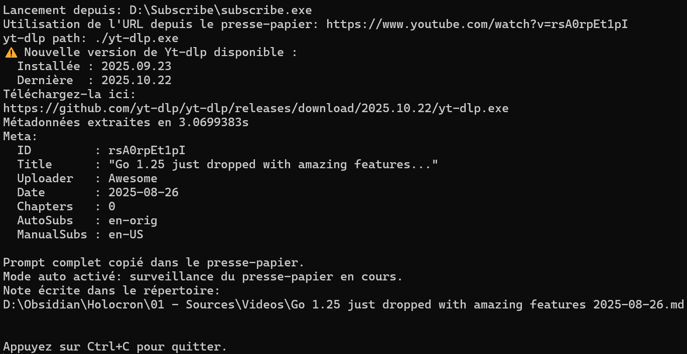
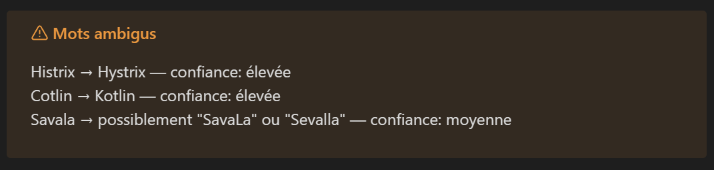
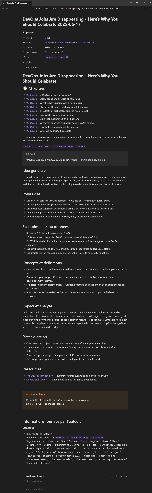

**SubScribe**, dans sa première phase de développement, est un outil en ligne de commande (Go) que j’ai développé pour **automatiser le flux « regarder → transcrire → noter »**. L’idée est de récupérer métadonnées et sous-titres depuis YouTube (via `yt-dlp`), transformer les pistes en transcripts, propose une fonction IA pour en résumés, puis générer des notes Markdown prêtes à intégrer dans Obsidian.

Le projet inclut une configuration YAML, des templates éditables et un mécanisme de mise à jour via l’API GitHub.


<svg xmlns="http://www.w3.org/2000/svg" 
     class="w-5 h-5 mr-2 inline-block" 
     fill="currentColor" viewBox="0 0 16 16">
<path d="M8 0C3.58 0 0 3.58 0 8a8 
           8 0 0 0 5.47 7.59c.4.07.55-.17.55-.38 
           0-.19-.01-.82-.01-1.49-2 
           .37-2.53-.49-2.69-.94-.09-.23-.48-.94-.82-1.13
           -.28-.15-.68-.52-.01-.53.63-.01 1.08.58 
           1.23.82.72 1.21 1.87.87 
           2.33.66.07-.52.28-.87.51-1.07-1.78-.2-3.64-.89-3.64-3.95
           0-.87.31-1.59.82-2.15-.08-.2-.36-1.02.08-2.12
           0 0 .67-.21 2.2.82a7.65 7.65 0 0 1 2-.27c.68 
           0 1.36.09 2 .27 1.53-1.04 2.2-.82 
           2.2-.82.44 1.1.16 1.92.08 2.12.51.56.82 
           1.27.82 2.15 0 3.07-1.87 3.75-3.65 
           3.95.29.25.54.73.54 1.48 
           0 1.07-.01 1.93-.01 2.2 
           0 .21.15.46.55.38A8 8 0 0 0 16 
           8c0-4.42-3.58-8-8-8z"/>
</svg>
Voir sur GitHub


## Diagramme de flux de données

Le schéma ci-dessous illustre le pipeline de traitement des données, du téléchargement YouTube à la génération automatique de notes dans Obsidian.


graph TD
A[URL YouTube] --> B["extraction via yt-dlp<br>(métadonnées + sous-titres)"]
B --> C["Parse le JSON"]
C --> D["Crée le Transcript"]
D --> E["Assistance IA<br>(optionnel)"]
E --> F["Renderer<br>(templates Obsidian)"]
F --> G["Note Markdown (.md)<br>→ Vault Obsidian"]
B -.-> H["Enregistrement <br>JSON/subs"]
D -.-> I["Enregistrement <br>Transcript"]


## Objectifs et valeur ajoutée

- Industrialiser la prise de notes à partir de vidéos : gagner du temps et garantir une mise en forme cohérente des notes.
- Produire des notes exploitables (chapitrage, métadonnées, hashtags) pour la recherche et l’indexation dans Obsidian.
- Permettre un enrichissement automatique via un flux d’assistance IA (génération de résumés / suggestions / détection et signalement des erreurs de transcription).



## Fonctionnalités principales

- Récupération automatique des métadonnées et sous-titres avec `yt-dlp`.
- Conversion des sous-titres (JSON3) en transcript et génération Markdown.
- Templates Obsidian embarqués et personnalisables.
- Configuration via `subscribe.yaml` avec capacité de migration de versions.
- Mode interactif ou exécution automatique (`--auto`).
- Vérification et téléchargement sécurisé des assets (timeouts, limites de taille).
- Mécanisme de vérification de mise à jour via l’API GitHub (possibilité de téléchargement direct à venir).

## Technologies utilisées

- Langage : **Go** (modules `go.mod`)
- Formats : **YAML**, **JSON**, **Markdown**
- Outils externes : **yt-dlp** (extraction), GitHub Releases API (mises à jour)
- Packaging : embedding d’assets (`embed.FS`) pour templates
- Tests unitaires pour parties critiques, gestion de la configuration et logique métier
- **GitHub Actions** (CI/CD)

## Compétences démontrées

**Techniques**

- Respect des principes _clean code_ (nommage explicite, chaque package a une responsabilité claire, chaque fonction fait une seule chose, les commentaires clarifient l'intention, etc)
- Architecture CLI : parsing flags, priorité config < flags, gestion d’assets embarqués.
- Conception modulaire (packages `internal/app`, `internal/obsidian`, `internal/subtitles`, etc.).
- Intégration d’outils externes et parsing JSON.
- Gestion de configuration (lecture, validation, migration YAML).
- Génération de contenu via templating et embed d’assets.
- Appels réseau robustes (timeouts, context) et gestion d’erreurs et validations.
- Tests unitaires et découplage pour testabilité.

**Transversales**

- Conception orientée utilisateur (templates prêts à l’emploi).
- Automatisation et orchestration (CLI + mode non-interactif).
- Ecriture de workflows pour déclencher automatiquement les tests et la compilation/release du binary
- Documentation et packaging pour distribution (README, assets embarqués).
- Prompt engineering / IA prompting : conception et optimisation du prompt qui résume le transcript



## Extraits de code

**1) Embedding des templates (illustration de packaging d’assets)**

```go
package obsidian

import "embed"

//go:embed assets/templates/*.tmpl
var embeddedTemplates embed.FS

func GetTemplates() embed.FS {
	return embeddedTemplates
}
```

_On embarque les modèles Markdown dans l’exécutable pour faciliter la distribution et garantir des templates cohérents. Ces templates sont écrits sur le disque à la première execution et entièrement éditables par l'utilisateur en suivants la documentation dans le README_

**2) Flags & initialisation CLI (extrait de `cmd/subscribe/main.go`)**

```go
func parseFlags() *app.CLIFlags {
	f := &app.CLIFlags{}
	flag.StringVar(&f.ConfigPath, "config", "subscribe.yaml", "path to config file")
	flag.StringVar(&f.URL, "url", "", "YouTube URL (optional)")
	flag.BoolVar(&f.Auto, "auto", false, "exécution automatique sans interaction")
	flag.StringVar(&f.YtDlpPath, "yt-dlp-path", "", "chemin absolu vers l'exécutable yt-dlp")
	flag.Parse()
	return f
}
```

_interface CLI simple, configurée et scriptable pour intégration en automatisation._
Exemples:

```
subscribe --config myconfig.yaml --auto
subscribe --url "https://www.youtube.com/watch?v=dQw4w9WgXcQ"
subscribe --yt-dlp-path "/usr/local/bin/yt-dlp"
```

**3) Téléchargement sécurisé d’une piste de sous-titres (extrait de `internal/app/tasks.go`)**

```go
// FetchSubtitleDownload télécharge la piste de sous-titres pour la meta `m` et la source `ss`.
func FetchSubtitleDownload(
	ctx context.Context, m *model.Meta, ss model.SubSource) (subtitles.SubtitleDownload, error) {
	var empty subtitles.SubtitleDownload
	maxBytes := int64(10_000_000)
	timeout := 15 * time.Second

	sd, err := subtitles.DownloadSubtitleFromMeta(ctx, m, ss, timeout, maxBytes)
	if err != nil {
		// s'il n'y a pas de sous-titres, ce n'est pas une erreur fatale...
		if errors.Is(err, subtitles.ErrNoSubtitle) {
			fmt.Printf("No %s available\n", string(ss))
			return empty, nil // ...on retourne la valeur vide + nil.
		}
		return empty, fmt.Errorf("download %s subtitles: %w", string(ss), err)
	}
	return sd, nil
}
```

_Prise en compte de contraintes réelles (taille maxi pour ne pas saturer la mémoire, timeouts, gestion d’erreur notamment avec errors.IS + ErrNoSubtitle)._

- **Limite de taille (`maxBytes`)** : on borne le poids du fichier à 10 Mo (large!) afin d'éviter de saturer la mémoire ou le réseau en cas de soucis.
- **Timeout (`15 * time.Second`)** : on ne veut pas bloquer l’appel si la source est lente ou ne répond pas.
- **Gestion d’erreur spécifique (`errors.Is` + `ErrNoSubtitle`)** : on distingue le cas « pas de sous-titres disponibles » (qui n’est pas une erreur fatale) des autres erreurs (réseau, parsing, etc.). L’absence de sous-titres est un scénario attendu, pas un bug.
- **Retour d’une valeur vide mais valide** : plutôt que de propager un `nil`, on renvoie un objet vide. Plus prévisible.
- **Message utilisateur clair (`fmt.Printf("No %s available\n")`)** : on logge l’absence de sous-titres, ce qui aide au diagnostic sans interrompre le flux.

_Note : la variable empty sert ici uniquement à exprimer clairement qu'on retourne un objet vide (empty). une autre option aurait été de faire return subtitles.SubtitleDownload{}_

**4) Requête API GitHub pour la vérification de nouvelles releases**

```go
package github

import (
	"context"
	"fmt"
	"io"
	"net/http"
)

const defaultUserAgent = "github-fetcher"

// FetchReleaseJSON interroge l’API GitHub pour la release d’un dépôt donné
func FetchReleaseJSON(ctx context.Context, owner, repo string) ([]byte, error) {
	url := fmt.Sprintf("https://api.github.com/repos/%s/%s/releases/latest", owner, repo)
	req, err := http.NewRequestWithContext(ctx, "GET", url, nil)
	if err != nil {
		return nil, fmt.Errorf("création requête GitHub: %w", err)
	}
	req.Header.Set("User-Agent", defaultUserAgent)

	resp, err := http.DefaultClient.Do(req)
	if err != nil {
		return nil, fmt.Errorf("requête GitHub: %w", err)
	}
	defer resp.Body.Close()

	if resp.StatusCode != http.StatusOK {
		return nil, fmt.Errorf("statut inattendu: %s", resp.Status)
	}

	data, err := io.ReadAll(resp.Body)
	if err != nil {
		return nil, fmt.Errorf("lecture du corps: %w", err)
	}
	return data, nil
}
```

_Requête HTTP idiomatique en Go, avec gestion du contexte, contrôle des erreurs et respect du principe de responsabilité unique._

**5) Workflow GA pour compilation/release**

```yaml
on:
  push:
    tags:
      - "v*"
  workflow_dispatch:

permissions:
  contents: write # Autorise la création/modification de release

jobs:
  build:
    runs-on: windows-latest

    steps:
      - name: Checkout code
        uses: actions/checkout@v4

      - name: Set up Go
        uses: actions/setup-go@v5
        with:
          go-version: "1.25.1"

      - name: Build Windows exe
        run: go build -o subscribe.exe ./cmd/subscribe

      - name: Upload to GitHub Release
        uses: softprops/action-gh-release@v1
        with:
          files: subscribe.exe
        env:
          GITHUB_TOKEN: ${{ secrets.GITHUB_TOKEN }}
```

- Déclenchement automatique lors d’un **push de tag `v*`** ou via **workflow manuel**
- Import du projet (**checkout**) dans la machine virtuelle GitHub Actions
- **Installation de Go 1.25.1** pour l’environnement de build
- **Compilation** du binaire Windows `subscribe.exe`
- **Publication automatique** du binaire dans une **GitHub Release**, prêt à télécharger

Déploiement en deux commandes seulement :

```bash
git tag v0.1.0
git push origin v0.1.0
```

## Résultat du programme

- Le titre de la fiche, le Front Matter, le chapitrage avec les liens, et la partie "Informations fournies par l'auteur" sont produites par le programme.
- Le résumé ainsi que les encart "Quote" et "Mots ambigus" sont le résultat de l'assistance IA.



## Conclusion personnelle

En développant SubScribe, j’ai commencé à apprendre Go par la pratique (packaging, embed, context/timeouts, etc) et j'ai renforcé ma capacité à concevoir des outils les plus robustes possibles et utilisables en production.

Le projet m’a aussi amené à travailler l’ergonomie d’un CLI, la documentation utilisateur, la conception orientée utilisateur, la gestion de templates et l’intégration d’outils existants (yt-dlp) — compétences directement applicables en environnement professionnel.
