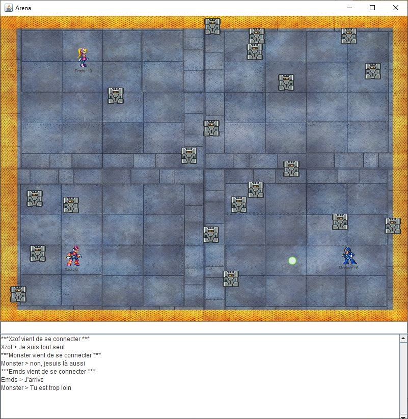

J'ai développé, dans le cadre de ma formation SIO SLAM, **UrbanMarginal** : un jeu 2D client/serveur en Java.
Le projet vise à démontrer la maîtrise de la programmation orientée objet et de la construction d'une interface utilisateur réactive.


<svg xmlns="http://www.w3.org/2000/svg" 
     class="w-5 h-5 mr-2 inline-block" 
     fill="currentColor" viewBox="0 0 16 16">
<path d="M8 0C3.58 0 0 3.58 0 8a8 
           8 0 0 0 5.47 7.59c.4.07.55-.17.55-.38 
           0-.19-.01-.82-.01-1.49-2 
           .37-2.53-.49-2.69-.94-.09-.23-.48-.94-.82-1.13
           -.28-.15-.68-.52-.01-.53.63-.01 1.08.58 
           1.23.82.72 1.21 1.87.87 
           2.33.66.07-.52.28-.87.51-1.07-1.78-.2-3.64-.89-3.64-3.95
           0-.87.31-1.59.82-2.15-.08-.2-.36-1.02.08-2.12
           0 0 .67-.21 2.2.82a7.65 7.65 0 0 1 2-.27c.68 
           0 1.36.09 2 .27 1.53-1.04 2.2-.82 
           2.2-.82.44 1.1.16 1.92.08 2.12.51.56.82 
           1.27.82 2.15 0 3.07-1.87 3.75-3.65 
           3.95.29.25.54.73.54 1.48 
           0 1.07-.01 1.93-.01 2.2 
           0 .21.15.46.55.38A8 8 0 0 0 16 
           8c0-4.42-3.58-8-8-8z"/>
</svg>
Voir sur GitHub


## Présentation

UrbanMarginal est une application Java permettant de lancer soit un serveur de jeu, soit plusieurs clients pour participer à une arène 2D. Le serveur maintient l'état du monde (joueurs, murs, projectiles) et synchronise les clients via des sockets TCP. Le client fournit une interface Swing, la gestion des entrées, du chat et des sons.



## Objectifs & valeur ajoutée

- Concevoir une application réseau temps réel simple et robuste.
- Appliquer une architecture claire (séparation Model / View / Controller) pour faciliter la maintenance.
- Illustrer la gestion de la concurrence, de la sérialisation d'objets et des I/O en Java.

Le projet montre une capacité à assembler des composants hétérogènes (réseau, UI, audio, tests) dans une application cohérente.

## Fonctionnalités principales

- Serveur multi-client (gestion des connexions via ServerSocket).
- Synchronisation de l'état du monde et propagation des actions des joueurs.
- Client Swing avec rendu de l’arène, gestion du clavier/souris et chat intégré.
- Lecture et gestion d’effets sonores au lancement d’événements (tir, collision).
- Tests unitaires (JUnit) et documentation Javadoc incluses dans le dépôt.

## Technologies

- **Langage :** Java
- **GUI :** Swing
- **Réseau :** Sockets TCP (ServerSocket / Socket, ObjectInput/OutputStream)
- **Concurrence :** Threads / Runnable
- **Tests :** JUnit 5
- **Documentation :** Javadoc
- **Outils :** Git, Eclipse (.project/.classpath)

## Compétences démontrées

- Architecture logicielle (séparation MVC, modularité).
- Gestion de la concurrence et des flux I/O (fiabilité, gestion des déconnexions).
- Mise en place de tests unitaires et de documentation technique.
- Intégration multimédia (gestion d’assets sonores) et interface utilisateur réactive.
- Communication et documentation (README, wiki, Javadoc dans le dépôt).

## Extraits de code représentatifs

### Gestion des collisions

```java
public Boolean toucheObjet (Objet objet) {
    if ((objet == null)) {return false;} //Un objet null ne peut pas provoquer de collision

    int thisPosXMax = this.posX + this.jLabel.getWidth();
    int objPosXMax  = objet.posX + objet.getjLabel().getWidth();
    int thisPosYMax = this.posY + this.jLabel.getHeight();
    int objPosYMax   = objet.posY + objet.getjLabel().getHeight();

    return (thisPosXMax > objet.posX &&
            this.posX < objPosXMax &&
            thisPosYMax > objet.posY &&
            this.posY < objPosYMax);
}
```

Le jeu utilise la méthode de **détection AABB** (Axis-Aligned Bounding Box) qui consiste à comparer deux boites pour simplifier les calculs.

```java
public Objet toucheCollectionObjetsAvecStream(Collection<Objet> lesObjets) {
    return lesObjets.stream()
                    .filter(objet -> !objet.equals(this) && this.toucheObjet(objet))
                    .findFirst()
                    .orElse(null);
}
```

Cette fonction utilise l’approche "moderne" des **Streams** en Java pour parcourir une collection.
Elle retourne le premier objet qui « touche » l’objet courant (déterminé par `toucheObjet`), en ignorant `this`, ou `null` si aucun n’est trouvé.

### Gestion des touches

`src/vue/Arene.java` — KeyAdapter redirigeant la touche vers le contrôleur

```java
txtChat.addKeyListener(new KeyAdapter() {
    @Override
    public void keyPressed(KeyEvent e) {
        contentPane_keyPressed(e);
    }
});

public void contentPane_keyPressed(KeyEvent e) {
    if (TOUCHES_VALIDES.contains(e.getKeyCode())) {
        this.controle.evenementArene(e.getKeyCode());
    }
}
```

Ajoute un KeyListener sur txtChat pour intercepter les frappes clavier, vérifie si la touche pressée (e.getKeyCode()) fait partie de TOUCHES_VALIDES, et si oui délègue le traitement à controle.evenementArene().

`src/controleur/Controle.java` — envoi d’un message ACTION quand l’info est un Integer

```java
public void evenementArene(Object info) {
    if (info instanceof Integer) {
        String message = ACTION + STRINGSEPARE + info;
        ((JeuClient) this.leJeu).envoi(message);
    }
    if (info instanceof String) { /* chat */ }
}
```

`src/modele/JeuServeur.java` — réception côté serveur : dispatch de l’action

```java
case ACTION:
    Integer action = Integer.parseInt(infos[1]);
    this.lesJoueurs.get(connection).action(action, this.lesJoueurs.values(), this.lesMurs);
```

`src/modele/Joueur.java` — application de l’action (KeyEvent → déplacement / tir)

```java
public void action(Integer action, Collection lesJoueurs, Collection lesMurs) {
    if (this.estMort()) { return; }
    switch (action) {
        case KeyEvent.VK_LEFT:
            deplace(-PAS, 0, lesJoueurs, lesMurs); this.orientation = GAUCHE; break;
        case KeyEvent.VK_RIGHT:
            deplace(PAS, 0, lesJoueurs, lesMurs); this.orientation = DROITE; break;
        case KeyEvent.VK_UP:
            deplace(0, -PAS, lesJoueurs, lesMurs); break;
        case KeyEvent.VK_DOWN:
            deplace(0, PAS, lesJoueurs, lesMurs); break;
        case KeyEvent.VK_SPACE:
            if (!this.boule.jLabel.isVisible()) { this.boule.tireBoule(this, lesMurs); } break;
    }
    this.affiche(MARCHE, this.etape);
}
```

Le flux est : UI → `Arene` (KeyAdapter) → `Controle.evenementArene` → `JeuClient.envoi` (message ACTION) → serveur (`JeuServeur`) → `Joueur.action`.
Le mapping KeyCode → comportement est centralisé dans `Joueur.action`.

## Conclusion

**Ce que j’ai appris :** Le projet m’a permis d’approfondir la programmation orientée objet en Java, de renforcer mes pratiques de séparation des responsabilités (MVC) et d’améliorer ma rigueur sur la gestion des threads et des tests automatisés. Il démontre une capacité à appréhender une application client/serveur de base.

---
